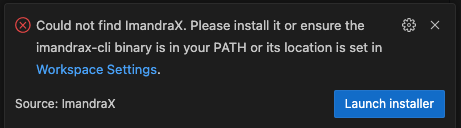
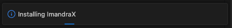
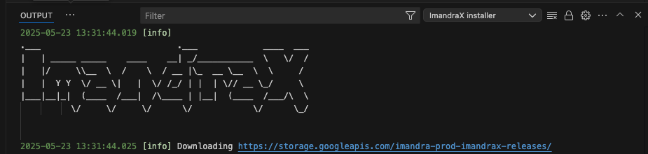
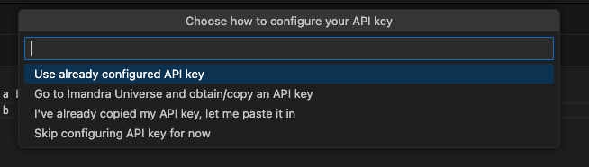
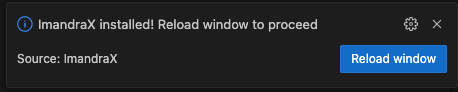

# ImandraX VSCode extension

This is the VSCode extension for Imandra's ImandraX automated theorem prover. 

## Installing ImandraX
To use the ImandraX LSP, an `imandrax-cli` binary must be in your `PATH`. If that's
missing, this extension will prompt you to install it. It will effectively run the script from
http://imandra.ai/get-imandrax.sh with all of the default options.

### Supported platforms
Please note that, at the moment, `imandrax-cli` binaries are only available for MacOS and Linux.
To use this extension on Windows, set up [WSL](https://learn.microsoft.com/en-us/windows/wsl/)
and initiate [VSCode remote development in WSL](https://code.visualstudio.com/docs/remote/wsl-tutorial).

### Opening `.iml` files

If the ImandraX VSCode extension is installed and `imandrax-cli` is not, then you'll
see something like this the first time you open an `.iml` file:



If you launch the installer, then you'll see a progress window for the duration of the
install:



### Viewing installer logs

The installer is generally silent, but if you want to see the output, it's available
in [VSCode's output panel](https://code.visualstudio.com/api/extension-capabilities/common-capabilities#output-channel) 
and [log files](https://code.visualstudio.com/updates/v1_20#_extension-logging):



### API key configuration

If everything goes well, then you should prompted to enter your API key
(or, if one was previously configured, to use an existing API key):



> Note: API keys are available from https://universe.imandra.ai/user/api-keys.

### Wrapping up

Once the installation is complete, you'll be prompted to reload the window:



After that, you should be able to use ImandraX.

## Debug settings

If anything goes wrong, you'll want to enable additional output, e.g. by adding
something along these lines to your `.vscode/settings.json`:

```
 "imandrax.lsp.arguments": [
    "--debug-lsp",
    "--debug-file=/tmp/lsp.log"
  ],
  "imandrax.lsp.environment": {
    "OCAMLRUNPARAM": "b"
  }
```
